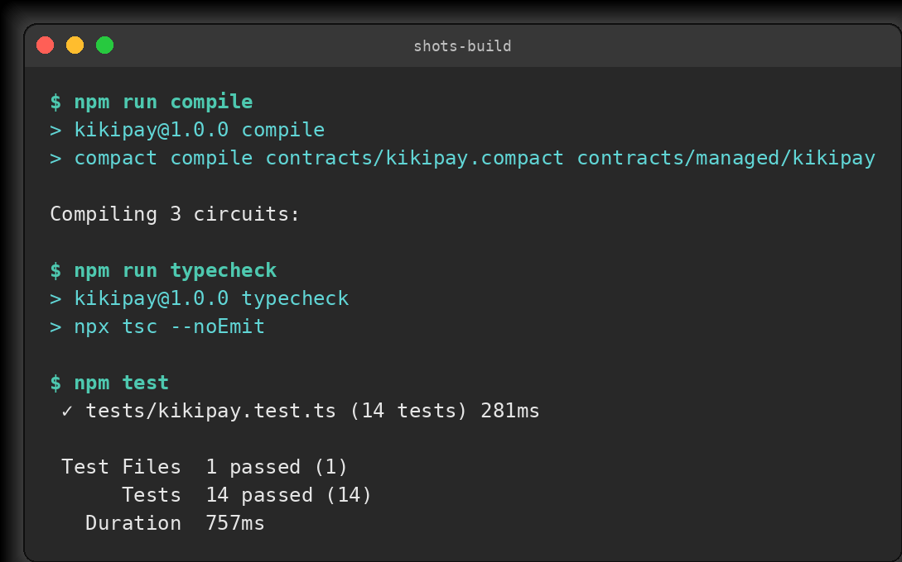
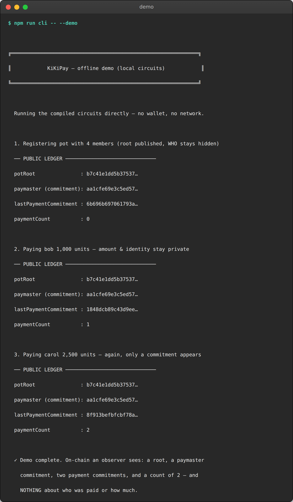
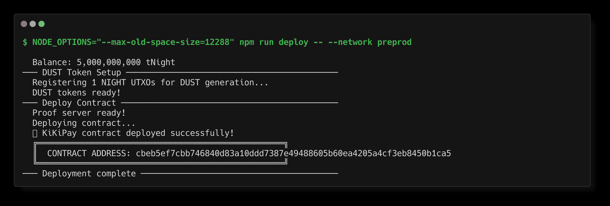
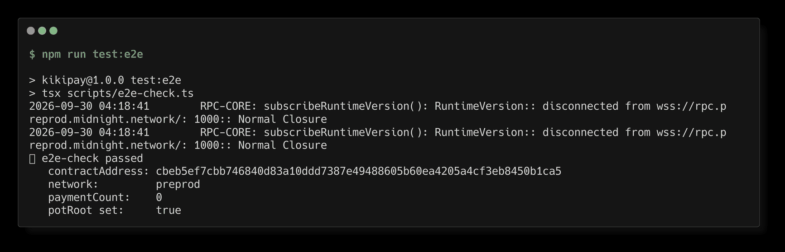

# KiKiPay — Private Payroll & Splits

> A Midnight smart contract that lets an organization distribute funds to a group of members **without exposing who the members are, who got paid, or how much each payment was**.

## Contract Address

| Network  | Address                                                                  |
|----------|--------------------------------------------------------------------------|
| Preview  | `0x74d6f4b7f37dbb455b4d89edd8d3e6e869ee077c3e27a9671101220203fc261f`     |
| Preprod  | `0xcbeb5ef7cbb746840d83a10ddd7387e49488605b60ea4205a4cf3eb8450b1ca5`     |

*(Deployed to Preview on 2026-09-29 and Preprod on 2026-09-29. Verify at
[midnightexplorer.com](https://midnightexplorer.com) or via the indexer —
note the query root field is `contractAction` (a `contract` field does not
exist on this API version):*

```bash
# Preprod (substitute indexer.preview… and the Preview address for Preview)
curl -s -X POST https://indexer.preprod.midnight.network/api/v4/graphql \
  -H 'Content-Type: application/json' \
  -d '{"query":"{ contractAction(address: \"cbeb5ef7cbb746840d83a10ddd7387e49488605b60ea4205a4cf3eb8450b1ca5\") { address state transaction { hash } } }"}'
```

A deployed contract answers with `"contractAction": { "address": "…",
"state": "6d69646e…", "transaction": { "hash": "…" } }` — the `state` blob is
the serialized contract ledger and the `__typename` is `ContractDeploy`.
Both deployments were verified live on 2026-09-29:

- Preprod deploy tx: `66547869633d24bb5f86f14edd6dc22495b8c6a26be64b49dc212fc149077b4c`

### Deployer wallets

The wallets that paid the deploy transactions (testnet tNIGHT only):

| Network | Deployer address | Fund with tNIGHT |
|---------|------------------------------------------------------------------|---|
| Preview | `mn_addr_preview1we7ldv0fr39nglfyz6nxe7j8szq8wyla0apx5pzkzlyhe9tn8eystp6t5x` | [faucet.preview.midnight.network](https://faucet.preview.midnight.network) |
| Preprod | `mn_addr_preprod1tzfwpanhw67vegsvalguwpfr2nml58z9ljgltljep9zr30sqdc7s2pmlxl` | [faucet.preprod.midnight.network](https://faucet.preprod.midnight.network) |

The 24-word recovery phrases are **not** committed here — they live only in
`.midnight-state.json` (gitignored, mode `600`). Back yours up when the deploy
script prints it; anyone holding the phrase controls the wallet.

## What This Does

KiKiPay is a payroll pot for a private member list:

1. **`registerPot`** — the sponsor registers a Merkle root committing to the
   approved members (up to 16, tree depth 4) and becomes the paymaster.
2. **`pay`** — the paymaster authorizes a payment to any member. The chain
   sees **only a hiding commitment** to the (payee, amount) pair and an
   incremented payment counter.
3. **`rotatePot`** — the paymaster swaps the member set for a new root
   (hiring/firing), proving they are still a member of the *new* set.

An outside observer can verify that payments happened, that they were
authorized, and that recipients are legitimate members — but cannot learn
**who** the members are, **who** got paid, or **how much**.

## Privacy Model

**What is PUBLIC (on-chain, visible to anyone):**

| Ledger field            | Meaning                                                        |
|-------------------------|----------------------------------------------------------------|
| `potRoot`               | Merkle root over the member set (membership itself is hidden)  |
| `paymaster`             | Hash commitment binding the current distributor                |
| `lastPaymentCommitment` | Hiding commitment to the latest (payee, amount) pair           |
| `paymentCount`          | Number of payments executed                                    |

**What is PRIVATE (circuit inputs via witnesses, never on-chain):**

- `paymasterSecret()` — the distributor's secret key
- `payeeMemberSecret()` — the payee's secret key
- `payeeProofPath()` / `payeeSideBits()` — the payee's Merkle authentication path
- `paymentAmount()` — the payment amount

**What the user PROVES without revealing:**

- *"I am the paymaster bound by the public `paymaster` commitment"*
- *"The payee is inside the committed member tree `potRoot`"* (Merkle proof)
- *"A payment of this (secret) amount to this (secret) member was made"* —
  the public commitment is exactly the image of both secrets and the amount

**Deliberate `disclose()` usage** (required by the rubric — every disclosure
in the contract is commented):

1. the new Merkle root in `registerPot` / `rotatePot` — membership *changes*
   must be auditable even though members stay anonymous;
2. the paymaster binding — authorization must be publicly verifiable;
3. the payment commitment in `pay` — payments must be publicly countable and
   later provable by the payee (who holds the secret).

## Tech Stack

- **Midnight network** (preview / preprod testnets, local devnet via Docker)
- **Compact** language, compiled with `compactc` 0.31.1 (language 0.23.0, runtime 0.16.0) via the `compact` CLI 0.5.2
  — this is the pairing pinned by `create-mn-app` and matched to midnight-js 4.1.1
- **Node.js v22+**, TypeScript, vitest
- **Docker** (proof server + local devnet)

## Prerequisites

- Node.js ≥ 22 (`node --version`)
- npm
- Docker running (`docker info`)
- The Compact toolchain (CLI + compiler):

  ```bash
  # The old `npm i -g @midnight-ntwrk/compact-compiler` package no longer exists.
  # The toolchain now ships from GitHub releases:
  mkdir -p /tmp/compact-install && cd /tmp/compact-install
  curl -sL -o compact-installer.sh \
    "https://github.com/midnightntwrk/compact/releases/download/compact-v0.5.2/compact-installer.sh"
  sh compact-installer.sh            # installs the `compact` CLI to ~/.local/bin
  compact update 0.31.1              # downloads the compactc 0.31.1 compiler
  compact --version                  # → compact 0.5.2
  ```

  Make sure `~/.local/bin` and `~/.compact/bin` are on your `PATH`.

## Setup

```bash
git clone https://github.com/winningtalker-commits/KiKiPay
cd KiKiPay
npm install

# 1. Compile the contract (creates contracts/managed/kikipay with ZK keys)
npm run compile

# 2. Start the proof server (needed for deploys and on-chain calls)
npm run proof-server:start

# 3a. Deploy to the Midnight PREVIEW testnet
#     (script pauses and prints the wallet address — fund it at the faucet
#      URL it prints; it detects the funding automatically and continues)
#     Full walkthrough with faucet/explorer links: see the next section.
NODE_OPTIONS="--max-old-space-size=12288" npm run deploy -- --network preview

# 3b. …or everything locally on a one-command devnet (node+indexer+proof server)
npm run setup
```

After deploying, paste the printed contract address into the
[Contract Address](#contract-address) table above.

## Networks, Wallets & Funding

Everything below was verified live on 2026-09-29. All testnet tokens are free.

### Network cheat sheet

| Resource | Preview | Preprod |
|---|---|---|
| **Faucet (tNIGHT)** | https://faucet.preview.midnight.network | https://faucet.preprod.midnight.network |
| Faucet (alternate) | https://midnight-tmnight-preview.nethermind.dev | https://midnight-tmnight-preprod.nethermind.dev |
| **Block explorer** | https://midnightexplorer.com (pick network in the UI) | https://midnightexplorer.com |
| RPC node | https://rpc.preview.midnight.network | https://rpc.preprod.midnight.network |
| Indexer (GraphQL) | https://indexer.preview.midnight.network/api/v4/graphql | https://indexer.preprod.midnight.network/api/v4/graphql |
| Docs: funding guide | [docs.midnight.network/guides/acquire-tokens](https://docs.midnight.network/guides/acquire-tokens) | same |
| Docs: deploy guide | [docs.midnight.network/guides/deploy-and-operate](https://docs.midnight.network/guides/deploy-and-operate) | same |

### The wallet

- **Lace (Midnight edition)** — the official browser-extension wallet:
  https://www.lace.io/midnight
- `npm run deploy` generates a **24-word BIP-39 recovery phrase** the first
  time it runs on each network. It is printed **once** in the terminal and
  stored in `.midnight-state.json` (gitignored). The same phrase restores the
  identical wallet in Lace — import it there to watch your tNIGHT balance in
  a GUI (optional; the deploy pipeline does not need Lace).
- Each network gets its **own** phrase/address (per-network wallets in the
  state file) — don't reuse one network's phrase on the other.

### Funding flow (both networks are the same 4 steps)

1. Start the deploy for your target network:

   ```bash
   # Preview (recommended for Level 1):
   NODE_OPTIONS="--max-old-space-size=12288" npm run deploy -- --network preview

   # …or Preprod:
   NODE_OPTIONS="--max-old-space-size=12288" npm run deploy -- --network preprod
   ```

2. When it reaches **─── Fund Wallet ───** it prints your `Wallet address:`
   (a `mnaddr…` bech32 string) and pauses, polling every 10 s.
3. Open the matching **faucet** link from the table above, paste the address,
   request tNIGHT, and grab a coffee — the script **detects the funding
   automatically** and continues into DUST registration + the deploy tx.
4. Verify the results:
   - `Wallet Address` / `Balance` lines in the deploy output,
   - the **CONTRACT ADDRESS** banner at the end → paste into the
     [Contract Address](#contract-address) table,
   - look the contract address up on **https://midnightexplorer.com** (a
     fresh deployment can take a minute to appear in the explorer).

### After the deploy

```bash
npm run network preview          # confirm the active network + last deploy address
npm run check-balance            # tNIGHT / tDUST balances
npm run cli                      # interactive console against the deployed contract
npm run cli -- --demo            # offline circuit demo (no wallet needed)
```

For preprod, substitute `preprod` in every command. Re-running the deploy is
safe — the seed is preserved and the script skips funding if the wallet
already holds tNIGHT.

## Run Tests

```bash
npm test          # 14 tests: circuit logic, state transitions, privacy
```

The suite executes the **real compiled circuits** through the Compact runtime
(no mocks): Merkle membership from both child positions, paymaster
authorization (positive + negative), pot registration/rotation, and explicit
privacy checks that no secret, path, or amount ever appears in public state.

Bonus commands:

```bash
npm run cli -- --demo   # offline walkthrough of the circuits (no wallet needed)
npm run test:e2e        # reconnect to the deployed contract on-chain (after deploy)
npm run typecheck       # tsc --noEmit
```

## Project Structure

```
KiKiPay/
├── contracts/
│   ├── kikipay.compact        ← the Compact contract (public vs private doc block)
│   ├── witnesses.ts           ← witness implementations (shared by tests/CLI)
│   └── managed/kikipay/       ← auto-generated by `npm run compile` (gitignored, 56 MB)
│       ├── contract/          ← compiled circuits + TS binding (index.js)
│       ├── keys/              ← registerPot / pay / rotatePot prover+verifier keys
│       └── compiler/ zkir/    ← compiler metadata + ZK intermediate reprs
├── src/                       ← deploy tooling + CLI (frontend comes in Level 2)
│   ├── deploy.ts              ← faucet-pause → DUST → deploy pipeline
│   ├── cli.ts                 ← interactive console (+ `--demo` offline mode)
│   ├── merkle.ts              ← off-chain mirror of the membership tree
│   ├── network.ts / wallet.ts ← Midnight.js network + wallet glue
│   └── setup.ts               ← one-command local devnet bootstrap
├── tests/
│   └── kikipay.test.ts        ← 14 tests over the real compiled circuits
├── scripts/                   ← e2e check + tooling helpers
├── docs/screenshots/          ← README screenshots (build, demo, deploy, verify)
├── .github/workflows/ci.yml   ← toolchain install → compile → test
├── docker-compose.yml         ← local devnet (node, indexer, proof server)
└── README.md
```

The ZK artifacts live in `contracts/managed/kikipay/` — the `create-mn-app`
convention, and the path the deploy script, the CLI, and CI all expect (CI
asserts `contracts/managed/kikipay/keys` exists). Some challenge outlines show
a top-level `managed/` instead; it is the same compiler output, just nested
beside the contract it belongs to.

## Initial Idea

I started from a problem I kept running into: payroll leaks. Every month a
traditional payroll run exposes the full social graph of an organization — who
is on the list, who got paid this cycle, and exactly how much each person earns
— to the bank, the blockchain (if it is paid on-chain), and anyone who can read
the ledger. For activist groups, diaspora communities sending money home, or
DAOs paying anonymous contributors, that is not a compliance footnote; it is a
safety problem.

So I set out to build the smallest thing that still counts as a real payroll: a
pot that pays approved members while the chain learns as little as possible. I
wanted exactly three things to be public, and nothing else:

- **one Merkle root** proving a *set of approved members exists* — without
  revealing who they are;
- **one commitment per payment** proving *a payment happened and was
  authorized* — without revealing the payee or the amount;
- **one counter**, so an outsider can still audit *that* payroll is flowing.

The constraint I kept coming back to was that privacy I cannot demonstrate is
not privacy — I did not want "privacy-preserving" in the marketing sense. That
is what pulled me to Midnight: the Compact contract keeps member secrets,
Merkle paths, and amounts as **witnesses** that never leave the prover, and
`disclose()` turns every public value into a deliberate, reviewable choice
instead of an oversight. Every disclosure in `kikipay.compact` is commented for
exactly that reason — the three audit points above are the whole public
surface.

From there the scope stayed deliberately narrow: three circuits (`registerPot`,
`pay`, `rotatePot`), a 16-member tree (depth 4), and a test suite that asserts
the negative property as loudly as the positive one — no secret, path, or
amount ever reaches public state, and two payments of the same amount stay
unlinkable across payees.

Two things I did not plan for shaped the build. The toolchain in the original
brief was already stale — the `@midnight-ntwrk/compact-compiler` npm package no
longer exists — so I moved to the GitHub-released `compact` CLI and pinned the
compactc 0.31.1 / runtime 0.16.0 pairing that `create-mn-app` and midnight-js
4.1.1 expect. And once the deploy pipeline worked I did not stop at one network:
the same contract runs on Preview and Preprod, which forced the faucet-pause,
DUST, and wallet-state handling to be genuinely robust rather than a one-off
script.

The next level is where I started: a browser UI for the payroll operator, and
real splits rather than a single payee per payment.

## Screenshots

Terminal captures from this repo (taken 2026-09-30): the live build pipeline,
the offline circuit demo, the Preprod deploy banner, and on-chain
verification of the deployed contract.

### 1. Build — compile (3 circuits), typecheck, and the 14-test suite



### 2. Offline demo — the public ledger after two payments

Only commitments and the counter change; the 1,000 and 2,500 unit payments
are indistinguishable on-chain.



### 3. Deploy to the Midnight Preprod testnet



### 4. Verify — e2e check against the live contract + indexer lookup


