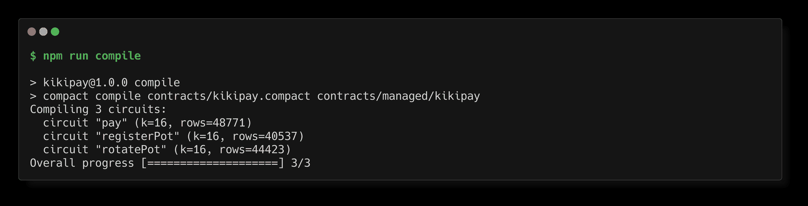
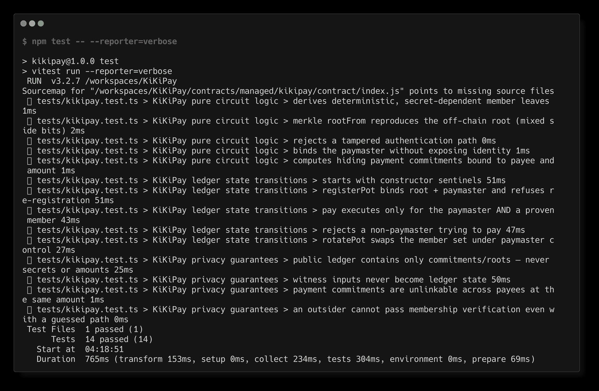

# KiKiPay — Private Payroll & Splits

[](https://github.com/winningtalker-commits/KiKiPay/actions/workflows/ci.yml)

> A Midnight dApp that lets an organization pay pot members **without exposing who the members are, who got paid, or how much each payment was** — Compact contract, ZK proofs generated in the browser, React + Vite frontend.

## Live Demo

**https://kikipay.vercel.app**

Connect a Lace wallet, generate a ZK proof locally in the browser, and
register a payroll pot on the live Preprod contract — no proof-server
infrastructure required from the visitor.

## Contract Address

| Network  | Address                                                                  |
|----------|--------------------------------------------------------------------------|
| Preview  | `0x74d6f4b7f37dbb455b4d89edd8d3e6e869ee077c3e27a9671101220203fc261f`     |
| Preprod  | `0xcbeb5ef7cbb746840d83a10ddd7387e49488605b60ea4205a4cf3eb8450b1ca5`     |

*(Deployed to Preview and Preprod on 2026-09-29. Verify at
[midnightexplorer.com](https://midnightexplorer.com) or via the indexer —
the query root field is `contractAction` (a `contract` field does not exist
on this API version):*

```bash
curl -s -X POST https://indexer.preprod.midnight.network/api/v4/graphql \
  -H 'Content-Type: application/json' \
  -d '{"query":"{ contractAction(address: \"cbeb5ef7cbb746840d83a10ddd7387e49488605b60ea4205a4cf3eb8450b1ca5\") { address state transaction { hash } } }"}'
```

A deployed contract answers with `"contractAction": { "address": "…",
"state": "6d69646e…", "transaction": { "hash": "…" } }` — the `state` blob is
the serialized contract ledger. The Preprod deploy tx was
`66547869633d24bb5f86f14edd6dc22495b8c6a26be64b49dc212fc149077b4c`.*

### Deployer wallets

The wallets that paid the deploy transactions (testnet tNIGHT only):

| Network | Deployer address | Fund with tNIGHT |
|---------|------------------------------------------------------------------|---|
| Preview | `mn_addr_preview1we7ldv0fr39nglfyz6nxe7j8szq8wyla0apx5pzkzlyhe9tn8eystp6t5x` | [faucet.preview.midnight.network](https://faucet.preview.midnight.network) |
| Preprod | `mn_addr_preprod1tzfwpanhw67vegsvalguwpfr2nml58z9ljgltljep9zr30sqdc7s2pmlxl` | [faucet.preprod.midnight.network](https://faucet.preprod.midnight.network) |

The 24-word recovery phrases are **not** committed here — they live only in
`.midnight-state.json` (gitignored). Back yours up when the deploy script
prints it; anyone holding the phrase controls the wallet.

## What This Does

KiKiPay is a payroll pot for a private member list:

1. **`registerPot`** — the sponsor registers a Merkle root committing to the
   approved members (up to 16, tree depth 4) and becomes the paymaster.
2. **`pay`** — the paymaster authorizes a payment to any member. The chain
   sees **only a hiding commitment** to the (payee, amount) pair and an
   incremented payment counter.
3. **`rotatePot`** — the paymaster swaps the member set for a new root
   (hiring/firing), proving they are still a member of the *new* set.

The Level 2 frontend drives `registerPot` end to end: click a button, the
browser derives the member secrets, builds the Merkle tree, generates the ZK
proof locally, and submits the transaction — the chain sees only the new pot
root.

An outside observer can verify that payments happened, that they were
authorized, and that recipients are legitimate members — but cannot learn
**who** the members are, **who** got paid, or **how much**.

## Privacy Model

**PUBLIC (on-chain, visible to anyone):**

| Ledger field            | Meaning                                                        |
|-------------------------|----------------------------------------------------------------|
| `potRoot`               | Merkle root over the member set (membership itself is hidden)  |
| `paymaster`             | Hash commitment binding the current distributor                |
| `lastPaymentCommitment` | Hiding commitment to the latest (payee, amount) pair           |
| `paymentCount`          | Number of payments executed                                    |

**PRIVATE (circuit inputs via witnesses, never on-chain):**

- `paymasterSecret()` — the distributor's secret key
- `payeeMemberSecret()` — the payee's secret key
- `payeeProofPath()` / `payeeSideBits()` — the payee's Merkle authentication path
- `paymentAmount()` — the payment amount

**PROVED without revealing:**

- *"I am the paymaster bound by the public `paymaster` commitment"*
- *"The payee is inside the committed member tree `potRoot`"* (Merkle proof)
- *"A payment of this (secret) amount to this (secret) member was made"* —
  the public commitment is exactly the image of both secrets and the amount

**Deliberate `disclose()` usage** (every disclosure in the contract is
commented):

1. the new Merkle root in `registerPot` / `rotatePot` — membership *changes*
   must be auditable even though members stay anonymous;
2. the paymaster binding — authorization must be publicly verifiable;
3. the payment commitment in `pay` — payments must be publicly countable and
   later provable by the payee (who holds the secret).

## Privacy Claim

**An on-chain observer of the Preprod contract sees exactly four values — the
Merkle root `potRoot`, the `paymaster` commitment, the latest
`lastPaymentCommitment`, and the `paymentCount` counter — and can verify that
a payment happened and was authorized. The same observer cannot learn who the
members are, who the paymaster is, who any payment went to, or how much any
payment was; those values exist only as ZK circuit witnesses, are generated in
the user's browser at call time, are never rendered by the UI, never appear in
a transaction payload beyond the proof itself, and never reach the server —
there is no KiKiPay backend at all (the frontend is a static Vercel/Netlify
site; the only network calls are to the public Preprod indexer and the proof
server).**

This is enforced, not asserted: `scripts/ui-smoke.mjs` renders the deployed
site in headless Chromium and fails if any private-input marker appears in the
DOM.

## Tech Stack

- **Midnight network** — Preprod testnet (contract) + public indexer
- **Compact** language, compiled with `compactc` 0.31.1 (runtime 0.16.0)
- **Midnight.js SDK 4.1.1** (`midnight-js-contracts`, `midnight-js-network-id`,
  `midnight-js-http-client-proof-provider`, `midnight-js-indexer-public-data-provider`,
  `midnight-js-level-private-state-provider`, `midnight-js-protocol`) +
  `@midnight-ntwrk/dapp-connector-api` (Lace)
- **React 19 + Vite 7** frontend, TypeScript strict
- **Lace wallet** (Midnight edition) — connect, network guard, tx relaying
- **Node.js 22+**, vitest (14 tests), Playwright (UI smoke)
- **Docker** (proof server + local devnet for the Level 1 CLI pipeline)
- Deploys: **Vercel** (`vercel.json`) or **Netlify** (`netlify.toml`)

> **Note on `@midnight-ntwrk/midnight-js-network-provider`:** the challenge
> brief lists this package, but it does not exist on npm at any version
> (verified 2026-09-30: `npm view` → 404). Its function — selecting the
> Midnight network — lives in `@midnight-ntwrk/midnight-js-network-id`
> (`setNetworkId`) plus the dapp-connector's `connect(networkId)`, both of
> which this dApp uses. Same situation as the stale
> `@midnight-ntwrk/compact-compiler` package documented in the Level 1 brief.

## Prerequisites

- **Lace wallet** browser extension (Midnight edition) —
  https://www.lace.io/midnight — with a Preprod test wallet
- **Node.js 22** or newer (`node --version`) — CI pins 22
- npm

For the Level 1 contract pipeline additionally: Docker (proof server) and the
Compact toolchain — see the *Contract pipeline* section under Run Locally.

## Setup & Run Locally

**Frontend (the dApp):**

```bash
git clone https://github.com/winningtalker-commits/KiKiPay
cd KiKiPay
npm install
npm run dev          # → http://localhost:5173
```

That's the whole flow: the compiled contract and ZK keys are committed (the
browser needs them at runtime) and `npm run dev` copies them into `public/`
automatically. Open the URL, install/enable Lace, connect, call the circuit.

Production build + local preview:

```bash
npm run build        # typecheck + vite build (includes copy-zk)
npm run preview      # serve dist/ at http://localhost:4173
node scripts/ui-smoke.mjs http://localhost:4173   # headless UI smoke test
```

**Deploy the frontend:**

```bash
# Vercel (vercel.json already configured):
npm i -g vercel
vercel --prod             # first run: link the project, accept defaults

# Netlify (netlify.toml already configured):
npm i -g netlify-cli
netlify deploy --build --prod
netlify deploy --build --prod --site <your-site-id>   # or link once interactively
```

Both platforms run `npm run build` and publish `dist/`; the SPA rewrites and
the `/contract/*` headers (caching + CORS for the ZK keys) are already in the
configs. After deploying, paste the live URL into
[Live Demo](#live-demo) above.

**Contract pipeline (Level 1 CLI: recompile, redeploy, on-chain console):**

```bash
npm run compile             # requires the Compact toolchain (below)
npm run proof-server:start  # docker compose up -d
npm run deploy -- --network preprod   # pauses until the faucet funding lands
```

Toolchain install (the old `@midnight-ntwrk/compact-compiler` npm package no
longer exists — the toolchain ships from GitHub releases):

```bash
mkdir -p /tmp/compact-install && cd /tmp/compact-install
curl -sL -o compact-installer.sh \
  "https://github.com/midnightntwrk/compact/releases/download/compact-v0.5.2/compact-installer.sh"
sh compact-installer.sh            # installs the `compact` CLI to ~/.local/bin
compact update 0.31.1              # downloads the compactc 0.31.1 compiler
compact --version                  # → compact 0.5.2
```

After deploying, paste the printed contract address into the
[Contract Address](#contract-address) table above.

## Networks & Funding (testnet tNIGHT — all free)

| Resource | Preview | Preprod |
|---|---|---|
| **Faucet** | https://faucet.preview.midnight.network | https://faucet.preprod.midnight.network |
| **Block explorer** | https://midnightexplorer.com | https://midnightexplorer.com |
| Indexer (GraphQL) | https://indexer.preview.midnight.network/api/v4/graphql | https://indexer.preprod.midnight.network/api/v4/graphql |

`npm run deploy` generates a 24-word BIP-39 phrase per network (printed once,
stored gitignored in `.midnight-state.json`). Import it into Lace to watch the
balance. Re-running the deploy is safe — it skips funding if the wallet is
already funded.

## Run Tests

On a fresh clone, **compile first** (or skip — `contracts/managed/` is
committed, so the tests run out of the box on this repo):

```bash
npm test          # 14 tests: circuit logic, state transitions, privacy
npm run typecheck # tsc --noEmit
```

The suite executes the **real compiled circuits** through the Compact runtime
(no mocks): Merkle membership from both child positions, paymaster
authorization (positive + negative), pot registration/rotation, and explicit
privacy checks that no secret, path, or amount ever appears in public state.

```bash
npm run cli -- --demo   # offline walkthrough of the circuits (no wallet needed)
npm run test:e2e        # reconnect to the deployed contract on-chain
```

<!-- EVIDENCE:TESTS:START (generated — do not edit inside) -->
<details>
<summary><strong>Full test source</strong> — <code>tests/kikipay.test.ts</code> (430 lines, verbatim, for reviewer verification)</summary>

```typescript
/**
 * KiKiPay contract test suite.
 *
 * Runs the ACTUAL compiled circuits (contracts/managed/kikipay) through the
 * Compact runtime — no mocks, no stubs. The same code that executes on chain
 * is executed here, minus proof generation (which only wraps the same
 * circuits and is exercised again at deploy time by the proof server).
 *
 * Coverage map (challenge rubric):
 *   1. Circuit logic         — pure helpers (leafFor / hashBranch / rootFrom /
 *                              publicCommit / paymentCommitment) + negative
 *                              authorization paths (asserts fire).
 *   2. State transitions     — registerPot → pay → rotatePot through the
 *                              simulator, checking every ledger field.
 *   3. Privacy               — the public ledger contains ONLY commitments
 *                              and roots; no secret, path, side bit, or raw
 *                              amount is recoverable from ledger state.
 */
import { describe, expect, it } from 'vitest';
import {
  type CircuitContext,
  type ConstructorContext,
  createCircuitContext,
  createConstructorContext,
  sampleContractAddress,
} from '@midnight-ntwrk/compact-runtime';
import {
  Contract,
  type Ledger,
  ledger,
  pureCircuits,
} from '../contracts/managed/kikipay/contract/index.js';
import {
  createKikiPayPrivateState,
  witnesses,
  type KikiPayPrivateState,
} from '../contracts/witnesses.js';

// ---------------------------------------------------------------------------
// Merkle tree built off-chain — byte-for-byte identical to what the circuit
// computes (same persistentHash, same ordering, same side-bit semantics).
// Fixed depth of 4 → exactly 16 leaves, matching the circuit's Vector<4, ...>.
// ---------------------------------------------------------------------------

const DEPTH = 4;
const LEAVES = 1 << DEPTH; // 16

/** utf8 → left-padded 32-byte array (Compact's pad(32, ...)). */
function bytes32(text: string): Uint8Array {
  const raw = new TextEncoder().encode(text);
  if (raw.length > 32) throw new Error(`"${text}" longer than 32 bytes`);
  const out = new Uint8Array(32);
  out.set(raw, 0);
  return out;
}

function randomSecret(seed: number): Uint8Array {
  const s = new Uint8Array(32);
  for (let i = 0; i < 32; i++) s[i] = (seed * 31 + i * 7 + 11) % 256;
  return s;
}

interface Member {
  secret: Uint8Array;
  leaf: Uint8Array;
  /** Authentication path: sibling hash at each level (length 4). */
  path: Uint8Array[];
  /** True when the member's node is the RIGHT child at that level. */
  side: boolean[];
}

function buildTree(secrets: Uint8Array[]): { root: Uint8Array; members: Member[] } {
  if (secrets.length > LEAVES) throw new Error('too many members for a depth-4 tree');
  // Pad the member list with placeholder (zero-secret) leaves up to 16.
  const padded = [...secrets];
  while (padded.length < LEAVES) padded.push(new Uint8Array(32));

  const members: Member[] = secrets.map((s) => ({
    secret: s,
    leaf: pureCircuits.leafFor(s),
    path: [],
    side: [],
  }));

  // Each node tracks the real members under its subtree so that, when it is
  // combined, every one of them records the sibling hash + side at this level.
  interface Node {
    hash: Uint8Array;
    subtree: Member[];
  }
  let nodes: Node[] = padded.map((s, i) => ({
    hash: pureCircuits.leafFor(s),
    subtree: i < secrets.length ? [members[i]] : [],
  }));

  while (nodes.length > 1) {
    const next: Node[] = [];
    for (let i = 0; i < nodes.length; i += 2) {
      const left = nodes[i];
      const right = nodes[i + 1];
      const hash = pureCircuits.hashBranch(left.hash, right.hash);
      for (const m of left.subtree) {
        m.path.push(right.hash);
        m.side.push(false);
      }
      for (const m of right.subtree) {
        m.path.push(left.hash);
        m.side.push(true);
      }
      next.push({ hash, subtree: [...left.subtree, ...right.subtree] });
    }
    nodes = next;
  }
  return { root: nodes[0].hash, members };
}

// ---------------------------------------------------------------------------
// Simulator — drives the compiled Contract class exactly like the official
// example-counter contract simulator.
// ---------------------------------------------------------------------------

const EMPTY_POT = bytes32('kikipay:empty-pot-root');
const EMPTY_PM = bytes32('kikipay:unset-paymaster');
const NO_PAYMENT = bytes32('kikipay:no-payment-yet');

class KikiPaySimulator {
  contract!: Contract<KikiPayPrivateState>;
  circuitContext!: CircuitContext<KikiPayPrivateState>;

  static async create(initial: KikiPayPrivateState): Promise<KikiPaySimulator> {
    const sim = new KikiPaySimulator();
    sim.contract = new Contract<KikiPayPrivateState>(witnesses);
    const ctorContext: ConstructorContext<KikiPayPrivateState> = createConstructorContext(
      initial,
      '0'.repeat(64),
    );
    const constructed = await sim.contract.initialState(ctorContext);
    sim.circuitContext = createCircuitContext(
      sampleContractAddress(),
      constructed.currentZswapLocalState,
      constructed.currentContractState,
      initial,
    );
    return sim;
  }

  getLedger(): Ledger {
    return ledger(this.circuitContext.currentQueryContext.state);
  }

  getPrivateState(): KikiPayPrivateState {
    return this.circuitContext.currentPrivateState as KikiPayPrivateState;
  }

  private as(actor: KikiPayPrivateState): CircuitContext<KikiPayPrivateState> {
    return {
      ...this.circuitContext,
      currentPrivateState: actor,
    } as CircuitContext<KikiPayPrivateState>;
  }

  async registerPot(actor: KikiPayPrivateState, newRoot: Uint8Array) {
    const res = await this.contract.impureCircuits.registerPot(this.as(actor), newRoot);
    this.circuitContext = res.context;
    return res.result;
  }

  async rotatePot(actor: KikiPayPrivateState, newRoot: Uint8Array) {
    const res = await this.contract.impureCircuits.rotatePot(this.as(actor), newRoot);
    this.circuitContext = res.context;
    return res.result;
  }

  async pay(actor: KikiPayPrivateState) {
    const res = await this.contract.impureCircuits.pay(this.as(actor));
    this.circuitContext = res.context;
    return res.result;
  }
}

// ---------------------------------------------------------------------------
// Shared fixtures
// ---------------------------------------------------------------------------

const secrets = [randomSecret(1), randomSecret(2), randomSecret(3), randomSecret(4)];
const tree = buildTree(secrets);
const [alice, bob, carol, dave] = tree.members;

/** State where alice (paymaster) pays `payee` the given amount. */
function payState(
  payee: Member,
  amount: bigint,
  paymaster: Member = alice,
): KikiPayPrivateState {
  return createKikiPayPrivateState(
    paymaster.secret,
    payee.secret,
    payee.path,
    payee.side,
    amount,
  );
}

/** Setup state where `actor` registers a pot they are a member of. */
function setupState(actor: Member, treeRoot: Uint8Array, actorPath: Uint8Array[], actorSide: boolean[]): KikiPayPrivateState {
  void treeRoot;
  return createKikiPayPrivateState(actor.secret, actor.secret, actorPath, actorSide, 0n);
}

const pmSetup = setupState(alice, tree.root, alice.path, alice.side);

// ---------------------------------------------------------------------------
// 1. CIRCUIT LOGIC
// ---------------------------------------------------------------------------

describe('KiKiPay pure circuit logic', () => {
  it('derives deterministic, secret-dependent member leaves', () => {
    const l1 = pureCircuits.leafFor(secrets[0]);
    const l2 = pureCircuits.leafFor(secrets[0]);
    expect(Buffer.from(l1).equals(Buffer.from(l2))).toBe(true);
    expect(Buffer.from(pureCircuits.leafFor(secrets[1])).equals(Buffer.from(l1))).toBe(false);
  });

  it('merkle rootFrom reproduces the off-chain root (mixed side bits)', () => {
    const computed = pureCircuits.rootFrom(alice.leaf, alice.path, alice.side);
    expect(Buffer.from(computed).equals(Buffer.from(tree.root))).toBe(true);
    for (const m of tree.members) {
      const r = pureCircuits.rootFrom(m.leaf, m.path, m.side);
      expect(Buffer.from(r).equals(Buffer.from(tree.root))).toBe(true);
    }
  });

  it('rejects a tampered authentication path', () => {
    const badSide = [...alice.side];
    badSide[1] = !badSide[1];
    const r = pureCircuits.rootFrom(alice.leaf, alice.path, badSide);
    expect(Buffer.from(r).equals(Buffer.from(tree.root))).toBe(false);
  });

  it('binds the paymaster without exposing identity', () => {
    const c = pureCircuits.publicCommit(alice.secret);
    expect(Buffer.from(c).equals(Buffer.from(pureCircuits.publicCommit(alice.secret)))).toBe(true);
    expect(Buffer.from(c).equals(Buffer.from(alice.secret))).toBe(false);
    expect(Buffer.from(c).equals(Buffer.from(alice.leaf))).toBe(false);
  });

  it('computes hiding payment commitments bound to payee and amount', () => {
    const c1 = pureCircuits.paymentCommitment(bob.secret, 1_000n);
    const c2 = pureCircuits.paymentCommitment(bob.secret, 1_000n);
    const otherAmount = pureCircuits.paymentCommitment(bob.secret, 2_000n);
    const otherPayee = pureCircuits.paymentCommitment(carol.secret, 1_000n);
    expect(Buffer.from(c1).equals(Buffer.from(c2))).toBe(true);
    expect(Buffer.from(c1).equals(Buffer.from(otherAmount))).toBe(false);
    expect(Buffer.from(c1).equals(Buffer.from(otherPayee))).toBe(false);
    const raw = Buffer.from(c1).toString('hex');
    expect(raw).not.toContain(1_000n.toString(16));
  });
});

// ---------------------------------------------------------------------------
// 2. STATE TRANSITIONS
// ---------------------------------------------------------------------------

describe('KiKiPay ledger state transitions', () => {
  it('starts with constructor sentinels', async () => {
    const sim = await KikiPaySimulator.create(pmSetup);
    const l = sim.getLedger();
    expect(Buffer.from(l.potRoot).equals(Buffer.from(EMPTY_POT))).toBe(true);
    expect(Buffer.from(l.paymaster).equals(Buffer.from(EMPTY_PM))).toBe(true);
    expect(Buffer.from(l.lastPaymentCommitment).equals(Buffer.from(NO_PAYMENT))).toBe(true);
    expect(l.paymentCount).toBe(0n);
  });

  it('registerPot binds root + paymaster and refuses re-registration', async () => {
    const sim = await KikiPaySimulator.create(pmSetup);
    const binding = await sim.registerPot(pmSetup, tree.root);
    let l = sim.getLedger();
    expect(Buffer.from(l.potRoot).equals(Buffer.from(tree.root))).toBe(true);
    expect(Buffer.from(l.paymaster).equals(Buffer.from(binding))).toBe(true);
    expect(Buffer.from(binding).equals(Buffer.from(pureCircuits.publicCommit(alice.secret)))).toBe(true);

    await expect(sim.registerPot(pmSetup, tree.root)).rejects.toThrow(/pot already registered/);
    l = sim.getLedger();
    expect(Buffer.from(l.potRoot).equals(Buffer.from(tree.root))).toBe(true); // unchanged
  });

  it('pay executes only for the paymaster AND a proven member', async () => {
    const sim = await KikiPaySimulator.create(pmSetup);
    await sim.registerPot(pmSetup, tree.root);

    const commitment = await sim.pay(payState(bob, 1_000n));
    const l = sim.getLedger();
    expect(l.paymentCount).toBe(1n);
    expect(Buffer.from(l.lastPaymentCommitment).equals(Buffer.from(commitment))).toBe(true);
    expect(
      Buffer.from(commitment).equals(Buffer.from(pureCircuits.paymentCommitment(bob.secret, 1_000n))),
    ).toBe(true);

    // non-member cannot be paid
    const outsider = createKikiPayPrivateState(
      alice.secret,
      randomSecret(99),
      [new Uint8Array(32), new Uint8Array(32), new Uint8Array(32), new Uint8Array(32)],
      [false, false, false, false],
      500n,
    );
    await expect(sim.pay(outsider)).rejects.toThrow(/not an approved member/);
  });

  it('rejects a non-paymaster trying to pay', async () => {
    const sim = await KikiPaySimulator.create(pmSetup);
    await sim.registerPot(pmSetup, tree.root);
    // bob pretends to be the paymaster (his secret as pmSecret)
    const impostor = createKikiPayPrivateState(
      bob.secret,
      carol.secret,
      carol.path,
      carol.side,
      1_000n,
    );
    await expect(sim.pay(impostor)).rejects.toThrow(/only the current paymaster/);
    expect(sim.getLedger().paymentCount).toBe(0n);
  });

  it('rotatePot swaps the member set under paymaster control', async () => {
    const sim = await KikiPaySimulator.create(pmSetup);
    await sim.registerPot(pmSetup, tree.root);

    const tree2 = buildTree([dave.secret, alice.secret]);
    const daveNode = tree2.members[0];
    const aliceNode2 = tree2.members[1];

    // non-paymaster cannot rotate
    const daveAsPm = createKikiPayPrivateState(
      dave.secret,
      dave.secret,
      daveNode.path,
      daveNode.side,
      0n,
    );
    await expect(sim.rotatePot(daveAsPm, tree2.root)).rejects.toThrow(/only the current paymaster/);

    // the paymaster — still a member of the NEW set — rotates successfully
    const pmInTree2 = createKikiPayPrivateState(
      alice.secret,
      alice.secret,
      aliceNode2.path,
      aliceNode2.side,
      0n,
    );
    const newBinding = await sim.rotatePot(pmInTree2, tree2.root);
    const l = sim.getLedger();
    expect(Buffer.from(l.potRoot).equals(Buffer.from(tree2.root))).toBe(true);
    expect(Buffer.from(l.paymaster).equals(Buffer.from(newBinding))).toBe(true);
    expect(Buffer.from(newBinding).equals(Buffer.from(pureCircuits.publicCommit(alice.secret)))).toBe(true);
  });
});

// ---------------------------------------------------------------------------
// 3. PRIVACY — private inputs are never exposed
// ---------------------------------------------------------------------------

describe('KiKiPay privacy guarantees', () => {
  it('public ledger contains only commitments/roots — never secrets or amounts', async () => {
    const sim = await KikiPaySimulator.create(pmSetup);
    await sim.registerPot(pmSetup, tree.root);
    const AMOUNT = 777_000n;
    await sim.pay(payState(bob, AMOUNT));

    const l = sim.getLedger();
    const publicFields = [l.potRoot, l.paymaster, l.lastPaymentCommitment];

    for (const m of tree.members) {
      for (const pub of publicFields) {
        expect(Buffer.from(pub).equals(Buffer.from(m.secret))).toBe(false);
        expect(Buffer.from(pub).equals(Buffer.from(m.leaf))).toBe(false);
      }
    }
    // the raw amount's byte encoding is not present in any public field
    const amountBytes: string[] = [];
    let a = AMOUNT;
    while (a > 0n) {
      amountBytes.push((a & 0xffn).toString(16).padStart(2, '0'));
      a >>= 8n;
    }
    for (const pub of publicFields) {
      const hex = Buffer.from(pub).toString('hex');
      expect(hex.includes(amountBytes.join(''))).toBe(false);
    }
  });

  it('witness inputs never become ledger state', async () => {
    const sim = await KikiPaySimulator.create(pmSetup);
    await sim.registerPot(pmSetup, tree.root);
    const before = sim.getLedger();
    await sim.pay(payState(carol, 5_000n));
    const after = sim.getLedger();

    // the only fields that changed are the commitment + count; and neither
    // equals any secret/path material the witnesses supplied
    expect(after.paymentCount).toBe(before.paymentCount + 1n);
    for (const m of tree.members) {
      expect(Buffer.from(after.lastPaymentCommitment).equals(Buffer.from(m.secret))).toBe(false);
      for (const sib of m.path) {
        expect(Buffer.from(after.lastPaymentCommitment).equals(Buffer.from(sib))).toBe(false);
      }
    }
  });

  it('payment commitments are unlinkable across payees at the same amount', () => {
    const cBob = pureCircuits.paymentCommitment(bob.secret, 1_000n);
    const cCarol = pureCircuits.paymentCommitment(carol.secret, 1_000n);
    const cDave = pureCircuits.paymentCommitment(dave.secret, 1_000n);
    expect(Buffer.from(cBob).equals(Buffer.from(cCarol))).toBe(false);
    expect(Buffer.from(cCarol).equals(Buffer.from(cDave))).toBe(false);
    expect(Buffer.from(cBob).equals(Buffer.from(bob.leaf))).toBe(false);
  });

  it('an outsider cannot pass membership verification even with a guessed path', () => {
    const outsiderSecret = randomSecret(4242);
    const fakePath = [bytes32('fake1'), bytes32('fake2'), bytes32('fake3'), bytes32('fake4')];
    const r = pureCircuits.rootFrom(pureCircuits.leafFor(outsiderSecret), fakePath, [
      false,
      false,
      false,
      false,
    ]);
    expect(Buffer.from(r).equals(Buffer.from(tree.root))).toBe(false);
  });
});
```

</details>
<!-- EVIDENCE:TESTS:END -->

## CI/CD

Every push to `main` and every pull request runs
[.github/workflows/ci.yml](.github/workflows/ci.yml):

1. **Checkout** the repository.
2. **Install Node.js 22** (with npm caching).
3. **Install the Compact toolchain** — the compact 0.5.2 CLI + the 0.31.1
   compiler, fetched from the official GitHub release.
4. **`npm install`**.
5. **`npm run compile`** — compile `contracts/kikipay.compact` and verify the
   `managed/` artifacts exist (compiled contract JS + prover/verifier keys).
6. **`npx tsc --noEmit`** — strict typecheck of the frontend.
7. **`npm test`** — the 14-test suite over the real compiled circuits
   (circuit logic, state transitions, privacy).
8. **`npm run build`** — production frontend bundle, verifying the deployable
   artifact and the served ZK assets.

The badge at the top of this README reflects the latest run on `main`.

## Product Proposal

See [PROPOSAL.md](PROPOSAL.md) — it substantively answers all four required questions:

1. **Product & users** — a private payroll pot: sponsors commit to a member set, paymasters pay members, and the chain sees only hiding commitments; built for DAO contributor payouts, NGO/journalist organizations and community treasuries whose payment graph is sensitive.
2. **Why Midnight** — payroll is data that must be verifiable but not visible; transparent chains publish the org chart and pay bands, custodial processors reintroduce the trust blockchain removes. Midnight keeps coordination public (roots, commitments, counts) while identities and amounts live only as witnesses.
3. **Data model** — an 11-row table splitting every data point into public ledger (potRoot, paymaster, lastPaymentCommitment, paymentCount) vs private witness (paymaster/payee keys, Merkle paths, amounts) vs ZK-proved membership and authorization.
4. **Mainnet feasibility** — realistic by Level 6: three constant-cost circuits and a fixed-depth tree keep proving fast in-browser; remaining work is operational (mainnet wallet/proof-server profile, external audit of the Merkle logic, sponsor key-custody tooling, payee receipt view).

## Project Structure

```
KiKiPay/
├── contracts/
│   ├── kikipay.compact        ← the Compact contract (public vs private doc block)
│   ├── witnesses.ts           ← witness implementations (shared by tests/dApp/CLI)
│   └── managed/kikipay/       ← compiled output (COMMITTED — the browser needs it)
│       ├── contract/          ← compiled circuits + TS binding (index.js)
│       ├── keys/              ← registerPot / pay / rotatePot prover+verifier keys
│       └── compiler/ zkir/    ← compiler metadata + ZK intermediate reprs
├── src/                       ← the Level 2 frontend (React + Vite)
│   ├── components/
│   │   ├── WalletConnect.tsx  ← wallet connect/disconnect UI + typed errors
│   │   └── CircuitCall.tsx    ← circuit call button + result display
│   ├── hooks/
│   │   └── useMidnight.ts     ← Midnight.js SDK hook (detection → session)
│   ├── lib/                   ← merkle, zk-config, address, constants
│   ├── App.tsx / main.tsx     ← app shell + entry
│   └── shims.ts, crypto-shim  ← Node-API browser shims (buffer/process/…)
├── cli/                       ← Level 1 deploy tooling + console (node-side)
├── tests/
│   └── kikipay.test.ts        ← 14 tests over the real compiled circuits
├── scripts/
│   ├── ui-smoke.mjs           ← Playwright: renders the site, asserts UI + privacy
│   ├── copy-zk-assets.mjs     ← managed → public/ (runs before dev/build)
│   └── e2e-check.ts           ← node-side on-chain reconnect check
├── public/                    ← favicon + vite-served ZK assets (gitignored copy)
├── docs/screenshots/          ← README screenshots
├── index.html, vite.config.ts ← Vite entry + browser shim config
├── vercel.json, netlify.toml  ← deploy configs (SPA rewrites, /contract headers)
├── .github/workflows/ci.yml   ← toolchain → compile → test → typecheck → build
├── docker-compose.yml         ← local devnet (node, indexer, proof server)
└── README.md
```

## Initial Idea

I started from a problem I kept running into: payroll leaks. Every month a
traditional payroll run exposes the full social graph of an organization — who
is on the list, who got paid this cycle, and exactly how much each person earns
— to the bank, the blockchain, and anyone who can read the ledger. For activist
groups, diaspora communities sending money home, or DAOs paying anonymous
contributors, that is not a compliance footnote; it is a safety problem.

So I set out to build the smallest thing that still counts as a real payroll: a
pot that pays approved members while the chain learns as little as possible. I
wanted exactly three things to be public, and nothing else:

- **one Merkle root** proving a *set of approved members exists* — without
  revealing who they are;
- **one commitment per payment** proving *a payment happened and was
  authorized* — without revealing the payee or the amount;
- **one counter**, so an outsider can still audit *that* payroll is flowing.

The constraint I kept coming back to was that privacy I cannot demonstrate is
not privacy — I did not want "privacy-preserving" in the marketing sense. That
is what pulled me to Midnight: the Compact contract keeps member secrets,
Merkle paths, and amounts as **witnesses** that never leave the prover, and
`disclose()` turns every public value into a deliberate, reviewable choice
instead of an oversight.

From there the scope stayed deliberately narrow: three circuits (`registerPot`,
`pay`, `rotatePot`), a 16-member tree (depth 4), and a test suite that asserts
the negative property as loudly as the positive one — no secret, path, or
amount ever reaches public state, and two payments of the same amount stay
unlinkable across payees.

Level 2 added the operator UI: connect Lace, and the browser does the proving.
Two things I did not plan for shaped the build: the toolchain in the original
brief was already stale (the `@midnight-ntwrk/compact-compiler` npm package no
longer exists, and Level 2's `midnight-js-network-provider` never did), so I
pinned the compactc 0.31.1 / runtime 0.16.0 pairing that midnight-js 4.1.1
expects and used `midnight-js-network-id` for network selection instead. And
once the deploy pipeline worked I did not stop at one network: the same
contract runs on Preview and Preprod, which forced the faucet-pause, DUST, and
wallet-state handling to be genuinely robust rather than a one-off script.

The next level is where I started: real splits rather than a single payee per
payment.

## Screenshots

Captured on 2026-09-30 by running each command and rendering its real output
with [termshot](https://github.com/homeport/termshot).

### 1. Compile — the three circuits



### 2. Tests — all 14 named tests passing



### 3. Offline demo — the public ledger after two payments


### 4. Deploy to the Midnight Preprod testnet


### 5. Verify — e2e check against the live Preprod contract


## Demo Video

**Level 3 one-minute demo:** ▶ [`kikipay-level3.mp4`](docs/demo/kikipay-level3.mp4) — live Vercel dApp, the connected session / Preprod deploy / on-chain verification, `npm test` with 14 passing, and the green CI badge on this README.

**Watch: [`kikipay-demo.webm`](./kikipay-demo.webm)** — recorded walkthrough:
the live dApp on Vercel (wallet panel, public ledger, typed wallet errors,
privacy labels), the three compiled circuits, the 14-test suite over the real
circuits, the offline ledger demo, the Preprod deploy, and the on-chain
verification against the live contract.

[PLACEHOLDER — I will add the link after recording]

Recording checklist (under 2 minutes, against https://kikipay.vercel.app):

1. **Connect** — click "Connect Lace wallet", approve in Lace, and show the
   shielded + transparent addresses appear on screen.
2. **Call the circuit** — click "Call registerPot — Proved without revealing
   your input"; the loading state shows the proof being generated locally
   ("Generating ZK proof locally…").
3. **On-chain result** — the success panel shows the tx id and new pot root;
   the Public Ledger panel below refreshes from the Preprod indexer.
4. **Privacy point** — show that nowhere in the UI were member secrets or
   amounts displayed; the only values on screen are what the chain publishes
   (root, commitments, counter). Point out the button's label and the footer:
   "private inputs never leave your browser".
